# Architecture

AdFlow Studio uses a local frontend for operation, Feishu Base for editable state, and n8n for long-running automation.

## System Components

- **Next.js frontend**: guides the user through Product, Hooks, Script, and Video steps.
- **Feishu Base**: stores product briefs, hook angles, scripts, and video tasks.
- **n8n**: runs scraping, LLM generation, image generation, video generation, polling, and status updates.
- **Firecrawl**: extracts product page content.
- **DeepSeek**: generates product briefs, hooks, scripts, UGC scene briefs, and prompts.
- **KIE**: generates the UGC key image and final short video.

## Data Flow

```mermaid
flowchart LR
  A["Product URL"] --> B["Next.js Workbench"]
  B --> C["Feishu: 产品工作台"]
  B --> D["n8n webhook"]
  D --> E["Firecrawl product extraction"]
  E --> F["DeepSeek product brief"]
  F --> C
  C --> G["User confirms brief"]
  G --> H["DeepSeek hook generation"]
  H --> I["Feishu: Hook角度池"]
  I --> J["User selects hook"]
  J --> K["DeepSeek script generation"]
  K --> L["Feishu: 脚本工作台"]
  L --> M["User confirms video inputs"]
  M --> N["KIE GPT Image 2 key image"]
  N --> O["KIE Seedance or Veo video"]
  O --> P["Feishu: 视频任务"]
  P --> B
```

## Why This Stack

- **Feishu Base** keeps the workflow inspectable and editable. Operators can modify briefs, review hooks, and audit generated assets.
- **n8n** handles slow and failure-prone automation outside the browser. This avoids frontend timeouts and makes workflow nodes easier to inspect.
- **Next.js** gives a clean guided interface for demos and daily use.
- **DeepSeek** is used for cost-effective text generation.
- **KIE** is used for image and video generation because it gives one API layer for GPT Image 2, Seedance, and Veo.

## Status Model

The frontend does not assume generation is instant. Each async step writes status back to Feishu and the frontend polls for updates.

Common statuses:

- Product brief generating
- Hook generating
- Script ready
- Generating key image
- Generating video
- Video ready
- Failed

## Public Release Boundary

Public GitHub content should include code, the production prompt templates in `prompts/`, sanitized workflow templates, and setup docs.

Do not commit:

- API keys
- Feishu app secrets
- Feishu data backups
- Local interview notes
- Private generated assets
